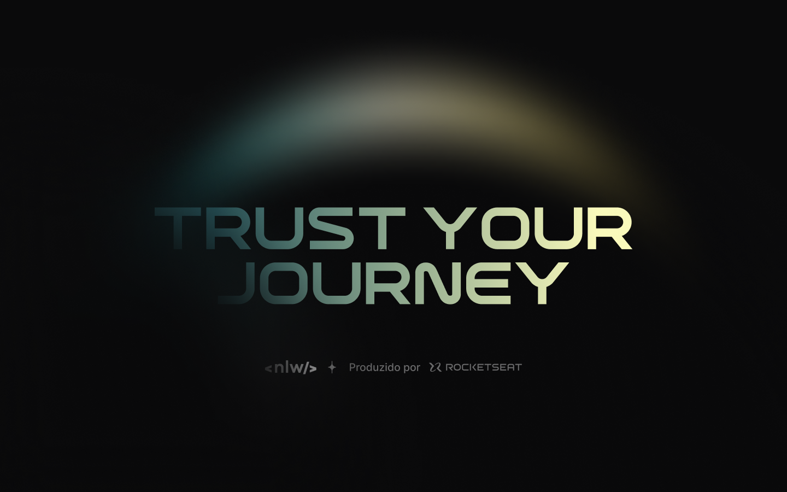

# NLW Journey (React.js)

Designed to manage trips, where you can create future trips and invite friends to interact and view the activities that will take place, allowing everyone to plan accordingly

## Requisites

- Axios;
- Lucide React;
- React day picker;
- React router dom;
- Tailwind;
- Typescript
- Vite

## Setup

Clone the repository;

```cl
git clone [Project Url here]
```

Install dependencies;

```cl
npm install
```

Run application server `nlw-journey-nodejs` at PORT 3333 or change axios file in src/lib/axios.ts

Run application;

```cl
npm run dev
```

Now test it!

## 📄 License

This project is kept by Wendell Bitencourt, but create and development by [Rocketseat](https://www.rocketseat.com.br/)

You can access the original repository [clicking here](https://github.com/rocketseat-education/nlw-journey-react)

<br />
